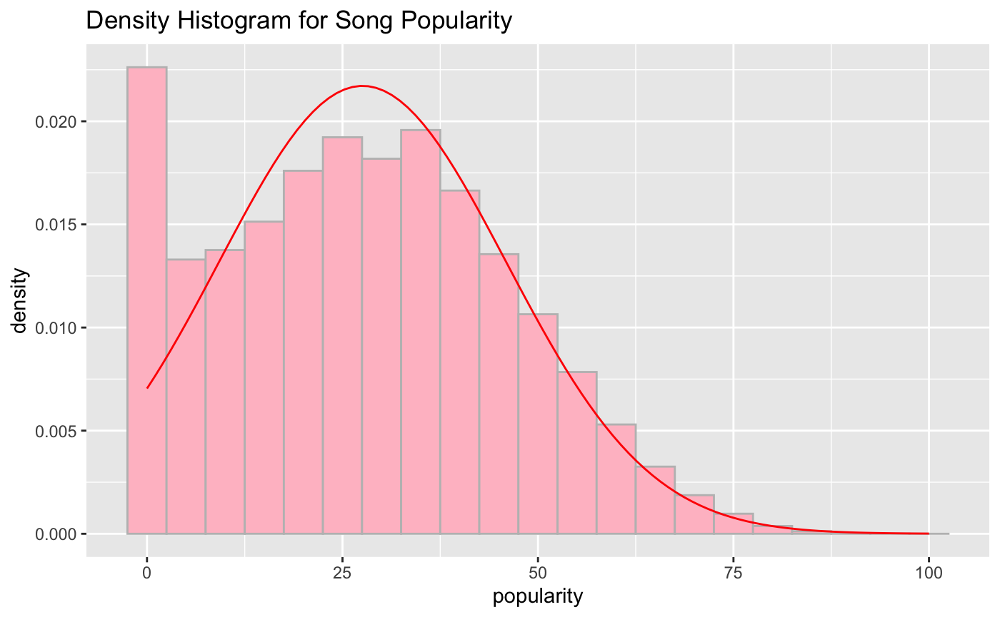
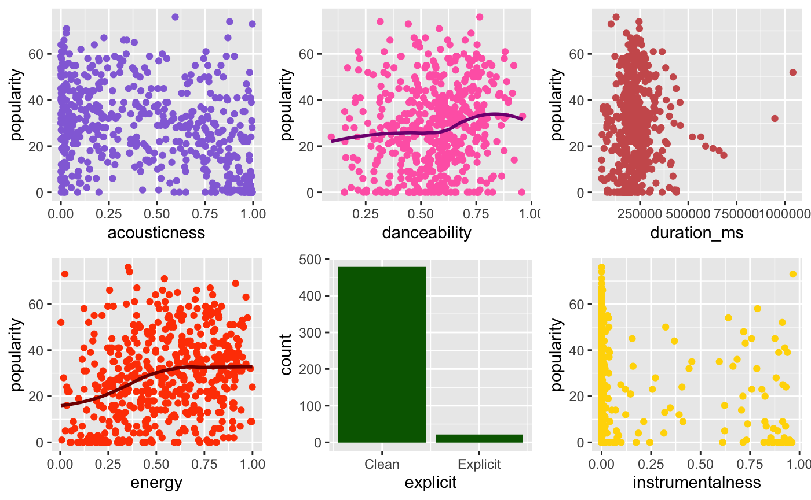
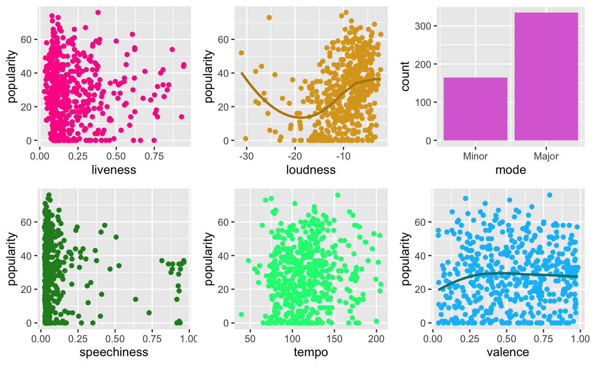
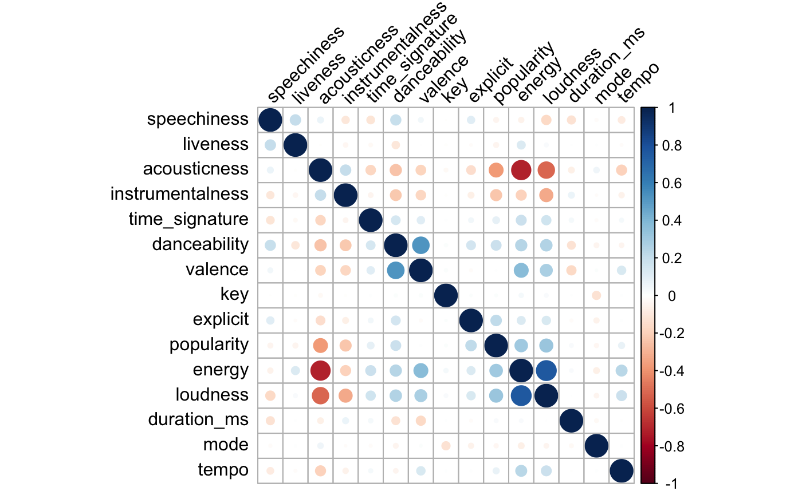
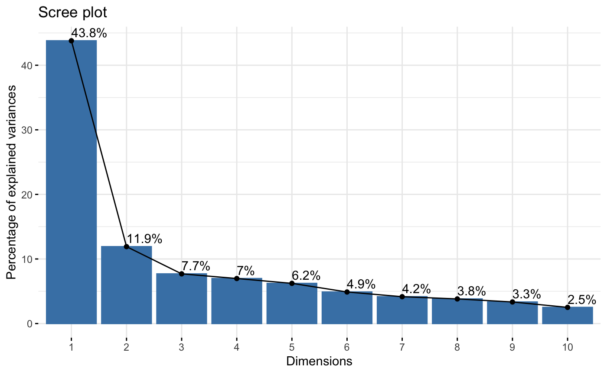
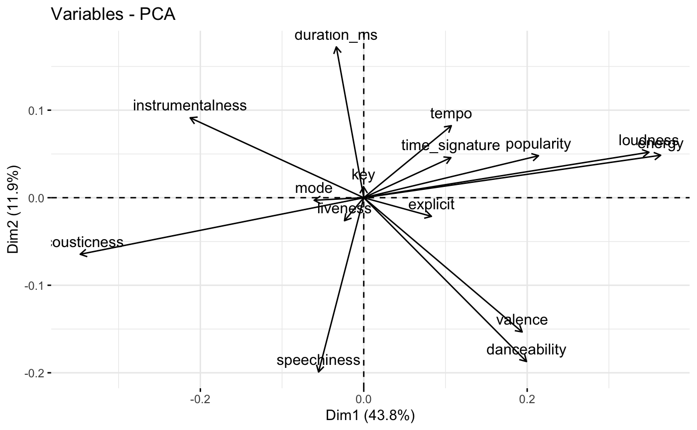

# Exploratory Data Analysis

## Distribution of Popularity

With popularity set as the response variable, we first did an analysis of the distribution of songs popularity using a density histogram (Fig.1). We discovered 2 findings. Firstly, there were many songs with 0 popularity, but we decided to leave this data in as songs on Spotify. Secondly, the majority of the songs have a popularity score of around 27.



## Analysing Individual Variables

Our group then subset the data to a size of 500 and analysed the individual variables using scatterplots to determine each feature's relationship to the response variable.




Based on the scatterplots (Fig.2), no one feature has a particularly strong relationship with the response variable popularity. Next, we computed the correlation matrix and the plot below to find out if any collinearity existed within our variables.

## Correlation between Variables



Based on the correlation plot (Fig. 3), we observe a strong positive correlation between loudness and energy, and a strong negative correlation between energy and acousticness. As high correlations between variables might cause multicollinearity issues in model training, model coefficients and predictions might be unstable and unreliable. To correct this, we considered either removing the highly correlated variable ‘energy’ or using Principal Component Analysis(PCA) to reduce the dimensions.

## Principal Component Analysis

We will first test the effectiveness of PCA in potentially reducing the multicollinearity issues caused by the strong correlation of energy with loudness and acousticness. 

```
Importance of components:
                          Comp.1    Comp.2     Comp.3     Comp.4     Comp.5     Comp.6
Standard deviation     0.7620286 0.3974208 0.31943590 0.30413488 0.28730213 0.25459238
Proportion of Variance 0.4379141 0.1191098 0.07695092 0.06975556 0.06224781 0.04888067
Cumulative Proportion  0.4379141 0.5570239 0.63397482 0.70373038 0.76597819 0.81485887
                           Comp.7     Comp.8     Comp.9    Comp.10    Comp.11    Comp.12
Standard deviation     0.23484885 0.22490549 0.21052239 0.18230677 0.17847051 0.14007512
Proportion of Variance 0.04159329 0.03814578 0.03342281 0.02506409 0.02402035 0.01479682
Cumulative Proportion  0.85645215 0.89459793 0.92802074 0.95308483 0.97710518 0.99190200
                           Comp.13     Comp.14 Comp.15
Standard deviation     0.096798034 0.036991076       0
Proportion of Variance 0.007066095 0.001031906       0
Cumulative Proportion  0.998968094 1.000000000       1
```
Fig.4 PCA Summary of the Principal Components

Based on the results above, our group will keep the first 4 principal components as they have a combined PVE of 0.7037, explaining 70.37% of the variation in the data.

```
                        Comp.1       Comp.2      Comp.3       Comp.4
popularity        0.2807122474  0.120741821  0.34103473  0.181082797
duration_ms      -0.0441102007  0.433634729  0.12788669  0.068585718
explicit          0.1087047540 -0.053557279  0.46517845  0.281144604
danceability      0.2613818075 -0.470916412 -0.12540174  0.294717193
energy            0.4768670383  0.122163823 -0.01125416 -0.201929052
key              -0.0004522316  0.031938157  0.10651933  0.277386425
loudness          0.4580341957  0.130758924 -0.01863841 -0.114674407
mode             -0.0797739807 -0.007312394 -0.27290627 -0.285513974
speechiness      -0.0725811413 -0.500968786  0.36784061 -0.188109095
acousticness     -0.4554930024 -0.162556111 -0.10043949  0.067620414
instrumentalness -0.2788563488  0.229794425 -0.16977721  0.114886116
liveness         -0.0309802578 -0.066169153  0.29424957 -0.636323987
valence           0.2544327682 -0.385915244 -0.43360044 -0.002626815
tempo             0.1406550961  0.207057502 -0.23742683 -0.247221834
time_signature    0.1399061679  0.115216486 -0.20914760  0.255004635
```
Fig.5 Loading Matrix of the First 4 Principal Components

From the figure above, our group analysed the contribution of each original variable to each principal component, with higher loadings indicating a stronger relationship. The loading matrix can help identify which variables are most important in explaining the variation in the data, and how they are related to each other.

- 1st Principal Component: Mainly influenced by popularity, loudness, energy, and danceability, with positive loadings for these variables. This suggests that these attributes are strongly correlated with each other, and that songs that are popular and have high energy and danceability tend to be loud.

- 2nd Principal Component: Mainly influenced by duration_ms and instrumentalness, with positive loadings for these variables. This suggests that songs with longer duration and higher instrumentalness tend to be grouped together.

- 3rd Principal Component: Mainly influenced by explicitness, speechiness, and valence, with positive loadings for explicitness and speechiness, and negative loadings for valence. This suggests that songs with explicit language and high levels of speech are associated with lower valence (i.e. less positive emotional expression).

- 4th Principal Component: Mainly influenced by liveness and key, with positive loadings for liveness and key. This suggests that songs in certain keys and with high levels of audience participation (i.e. liveness) tend to be grouped together.

## Scree Plot & Biplot




Further analysis done from the scree plot (Fig.6) agrees that 4 principal components best explain the variance in the data, and that energy has a strong positive correlation with loudness, as well as a strong negative correlation with acousticness(Fig.7).
